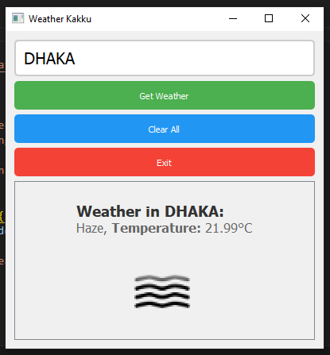

# Weather Kakku

Weather Kakku is a simple weather application built using PyQt5 and the OpenWeatherMap API. It allows users to fetch weather data for a specific location and view it in a user-friendly format.

## Features

- Fetches weather data from the OpenWeatherMap API.
- Displays weather information including temperature and weather description.
- Minimalistic and user-friendly GUI.
- Ability to clear input and exit the application.

## Requirements

- Python 3.x
- PyQt5
- requests library

## Installation

1. Clone this repository:
   ```
   git clone https://github.com/your_username/weather-kakku.git
   ```

2. Install the required dependencies:
   ```
   pip install -r requirements.txt
   ```

3. Obtain an API key from [OpenWeatherMap](https://openweathermap.org/api) and replace `"YOUR_API_KEY"` in the code with your actual API key.

## Usage

1. Run the application:
   ```
   python weather_app.py
   ```

2. Enter the location for which you want to fetch weather data and click "Get Weather".

3. View the weather information displayed on the screen.

4. Use the "Clear All" button to clear input and results, and the "Exit" button to close the application.


## Screenshots




---

🌟"The only way to do great work is to love what you do." - Steve Jobs 🚀
```

